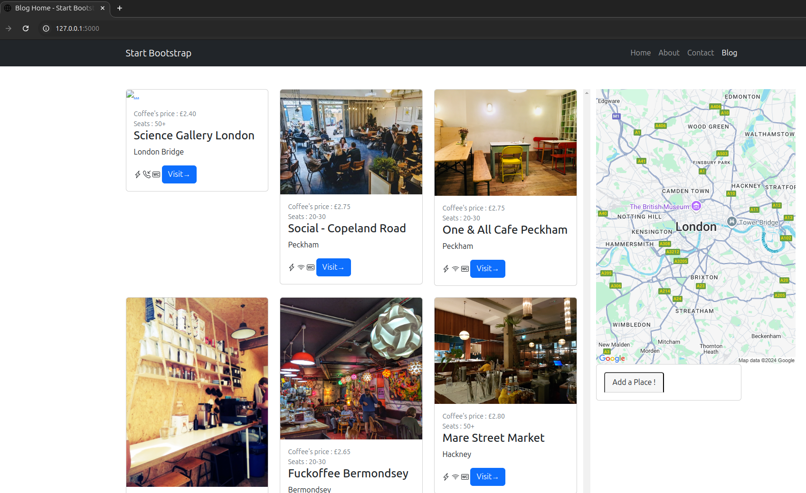

#WorkTogetherWebsite
To be continue

#Desc
- SqlAlchemy are used for Model
- Flask for control
- GooGle Static API for google map display
- Construction of Longitud/latitude used in Marker for the Google's Map
## Screenshot
